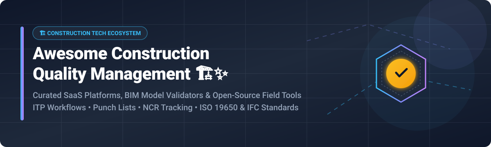

  

# 🏗️ Awesome Construction Quality Management ✨

  
  
  
  

## 📋 Top Construction Quality Management Platforms & Open-Source Ecosystem

**Curated List of SaaS Products & Open-Source GitHub Projects for Construction Field Control, BIM Model Validation, Inspection & Test Plans (ITP), Punch Lists, and Non-Conformance Reports (NCR)** 🚀

> **SEO Keywords**: Construction Quality Management, Construction Field Inspection, Inspection and Test Plan (ITP), Non-Conformance Report (NCR) Software, BIM IFC Model Validator, Punch List Management, ISO 19650 Quality Control, Construction Tech Open Source.

**Last updated:** September 2026 📅

---

### 💡 Overview & Market Landscape

This repository tracks notable **SaaS platforms** and **open-source projects** for **Construction Quality Management**. These solutions assist general contractors, quality managers, civil engineers, and site inspectors in digitizing field inspections, automating punch lists, tracking non-conformance reports (NCRs), and maintaining audit-ready quality trails.

#### 📊 Market Dynamics & Industry Structure

> **Market Size & Structure:** The global **Construction Management Software Market** is estimated at **$10.2 Billion (2026)** and projected to reach **$18.5 Billion by 2032** (CAGR ~10.4%). The sector is **moderately fragmented**, dominated at the enterprise level by consolidated tech behemoths (Autodesk, Procore) alongside specialized point-solution SaaS vendors (HammerTech, Inspectivity) and an emerging open-source ecosystem.

---

## 📑 Table of Contents
- [🏢 SaaS / Hosted Platforms](#-saas--hosted-platforms)
- [🔓 Open-Source GitHub Projects](#-open-source-github-projects)
- [🛠️ How to Contribute](#️-how-to-contribute)
- [☕ Support & Sponsorship](#-support--sponsorship)
- [📈 Star History](#-star-history)
- [⚠️ Disclaimer](#️-disclaimer)

---

## 🏢 SaaS / Hosted Platforms

Below is a curated summary of commercial enterprise construction quality management platforms, ordered by company size (revenue / valuation):

| SaaS Platform | Enterprise Size (Revenue / Valuation) 💰 | Pricing / Starting Tier 💵 | Free Tier / Trial Limit ⏳ | Key Quality Features 🔍 |
| :--- | :--- | :--- | :--- | :--- |
| **[Autodesk Build](https://construction.autodesk.com/)** | **$45.0B Market Cap** ($7.2B+ Annual Revenue) | **$55/user/month** (billed annually for Autodesk Build 550 sheet plan) | **30-Day Free Trial** (Full functional access, no credit card required) | Model-linked inspection records connected to Revit elements, ISO 19650 BIM document control, digital checklists, NCRs & commissioning workflows. |
| **[Procore Quality](https://www.procore.com/)** | **$7.5B Market Cap** ($1.3B+ Annual Revenue) | **$375/month** (Base Tier fixed annual contract based on Construction Volume) | **14-Day Custom Free Demo / Trial** (Available upon sales consultation) | Integrated field inspection forms, punch list capture, mobile observations, commitment tracking & change order quality logs. |
| **[Fieldwire](https://www.fieldwire.com/)** | **$300M Acquisition** (Acquired by Hilti Group) | **$39/user/month** (Pro Tier billed annually; Business Tier at $59/user/month) | **Free Forever Tier** (Up to 5 users, 3 projects, and 100 sheets limit) | Mobile plan markups, task management, defect management, photo location tagging, and field inspection checklists. |
| **[HammerTech](https://www.hammertech.com/)** | **$80M Total Funding** ($70M Growth Round led by Riverwood Capital) | **$500/project/month** (Estimated starting enterprise project plan) | **14-Day Sandbox Demo Trial** (Offered during enterprise evaluation) | Safety & quality intelligence, ITP management, subcontractor qualification, NCR compliance tracking, Procore sync. |
| **[Finalcad](https://www.finalcad.com/)** | **$73M Cumulative Funding** (~$6.3M Annual Revenue) | **€35/user/month** (Finalcad One standard plan) | **14-Day Free Trial** (Finalcad One mobile app free tier testing) | Mobile defect snagging, quality control templates, site inspection reporting, field collaboration & structural progress analytics. |
| **[FlowForma](https://www.flowforma.com/)** | **€4M Institutional Funding** (~$4.5M Estimated Revenue) | **$625/month** (Essentials Tier up to 100 process users) | **14-Day Free Trial** (Full access to Microsoft 365 process automation templates) | No-code workflow automation for construction quality processes, digital sign-off approvals, handovers & governance. |
| **[SiteMax](https://sitemaxsystems.com/)** | **$7.5M CAD Valuation Cap** (~$3.1M Annual ARR) | **$25/user/month** (Field User plan starting tier) | **14-Day Guided Free Trial** (Full site management features) | Daily logs, safety & quality inspection checklists, time tracking, digital form builder & task observations. |
| **[Inspectivity](https://www.inspectivity.com/)** | **Private / Independent** (Mining & Engineering Inspection Specialist) | **$49/user/month** (Professional tier starting price) | **14-Day Free Evaluation Account** (Includes sample asset inspection templates) | Dedicated ITP digital checklists, hold & witness point sign-offs, offline mobile inspections & asset integrity management. |
| **[SnagR](https://snagr.com/)** | **Private / Independent** (Global Snagging & Quality Platform) | **$15/user/month** (Starting site inspector license) | **14-Day Trial Project** (Available upon request for project evaluations) | Visual snagging & defect management, floor plan defect pinning, KPI quality analytics dashboards & site closeout workflows. |

---

## 🔓 Open-Source GitHub Projects

Construction quality management has a rapidly expanding open-source ecosystem. Below are top repositories sorted by GitHub_Stars (descending):

| Open-Source Project | GitHub Stars_Badge 🌟 | Description & Quality Focus 🛠️ |
| :--- | :--- | :--- |
| **[IfcOpenShell / BlenderBIM](https://github.com/IfcOpenShell/IfcOpenShell)** |  | **The open-source IFC toolkit & geometry engine.** Powers automated code checking, rule verification, structural compliance analysis, and BIM validation scripts in Python and C++. |
| **[OpenConstructionERP](https://github.com/datadrivenconstruction/OpenConstructionERP)** |  | **Comprehensive open-source Construction ERP (AGPL-3.0).** Includes 192 modules with built-in **Inspection & Test Plan (ITP)** workflow: define hold/witness points, execute field checks, sign off records, and assemble audit trails. |
| **[OpenAEC BIM Validator](https://github.com/OpenAEC-Foundation/OpenAEC-BIM-validator)** |  | **Browser-based IFC validation tool.** Validates IFC models against Information Delivery Manual / Specification (IDS) requirements (NL-BIM, RVB), visualizes model issues in 3D, and exports BCF issues. |
| **[concrete-structures-code-checking](https://github.com/jefalvesf/concrete-structures-code-checking)** |  | **Automated compliance checking for reinforced concrete.** Python-based tool utilizing IfcOpenShell to verify NBR 6118:2023 structural code requirements on BIM models. |
| **[ITC СтройКонтроль (ccj-frontend)](https://github.com/storkych/ccj-frontend)** |  | **Full-stack construction control journal & quality review system.** Provides foremen daily checklists, violation management workflows, QR code site logging, and computer vision document recognition. |
| **[bim-ifc-audit-bot](https://github.com/walqed/bim-ifc-audit-bot)** |  | **Telegram bot for automated IFC quality auditing.** Runs exact geometric collision detection via IfcOpenShell, inspects attribute completeness, and exports Excel audit reports. |
| **[agent-quality-oss](https://www.npmjs.com/package/agent-quality-oss)** |  | **AI-powered MCP server for construction quality control.** Supplies form structures and criteria ontology for ITPs, NCRs, test reports, and legal citations based on Korean construction standards. |

---

## 🛠️ How to Contribute

Contributions are welcome! Help us maintain the ultimate index of construction quality control software:

1. Fork this repository 🍴
2. Create your feature branch (`git checkout -b feature/add-tool`)
3. Add your entry to `README.md` maintaining table formatting and objective descriptions 📝
4. Submit a Pull Request with details 🚀

Please check out our list of awesome resources: [Awesome-Awesome-Awesome](https://github.com/ishandutta2007/Awesome-Awesome-Awesome) ⭐

---

## ☕ Support & Sponsorship

If you find this curated list valuable for your research, projects, or construction tech stack implementation, please consider supporting the project! 💖

- **Star this repository** to help others discover it! 🌟
- **Fork & Share** with your colleagues, quality managers, and AEC engineering teams 📢
- **Sponsor the developer** or buy a coffee via [GitHub Sponsors](https://github.com/sponsors/ishandutta2007) ☕

Your support keeps open-source construction tech documentation active and up to date!

---

## 📈 Star History

---

## ⚠️ Disclaimer

- This list is **community-curated** for educational and research purposes — it does not constitute official endorsement.
- Construction quality management platforms handle critical safety and structural compliance data; verify all tool outputs against relevant local building codes and contractual quality standards.
- **Open-source ecosystem note**: Open-source tools (e.g., OpenConstructionERP, OpenAEC BIM Validator, IfcOpenShell) provide strong foundations for custom ITP management and IFC model validation, but commercial SaaS platforms (Autodesk Build, Procore) offer enterprise-grade scalability, mobile sync, and turn-key field adoption out of the box.

---

  <b>Made with ❤️ for Quality Managers, Site Inspectors, Civil Engineers & Construction Technologists.</b>

